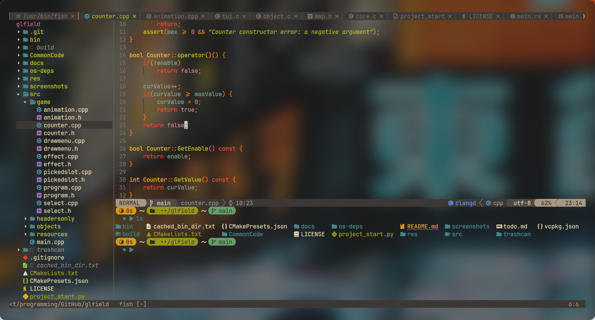

# otryvnoy-nvim-config

My neovim configuration based on `lazy.lua`. The configuration is still under development. It is adapted for use with wm (in my case, it's `hyprland`), `kitty`, `fish`. There is little support for `powershell` and `Windows`.

### additional dependencies
* rust
* rust-analyzer
* yarn
* ruff
* npm
* luajit
unix-like systems only:
* chafa (for displaying images)
* imagemagick
* xclip/xsel/wl-clipboard

### Language support
There is support for spell checking of the Russian language. For this to work, don't do anything with the `spell` folder.

### Programming language support
LSP protocols are configured for languages:
* C/C++
* CSS
* GO
* RUST
* PYTHON

### Basic mappings
| mapping   | description    |
|----------|----------------|
| `jj`/`jk`  | switch to normal mode |
| `leader`+`e`   | open the file tree   |
| `:cd directory_name`   | go to the directory in the file tree   |
| `leader`+`h`  | open horizontal terminal |
| `leader`+`v`  | open vertiacal terminal |
| `leader`+`x` | switch to normal mode in terminal |
| `leader`+`/` | comment code lines |
| `Alt`+`j`/`k` | move code line up/down |

